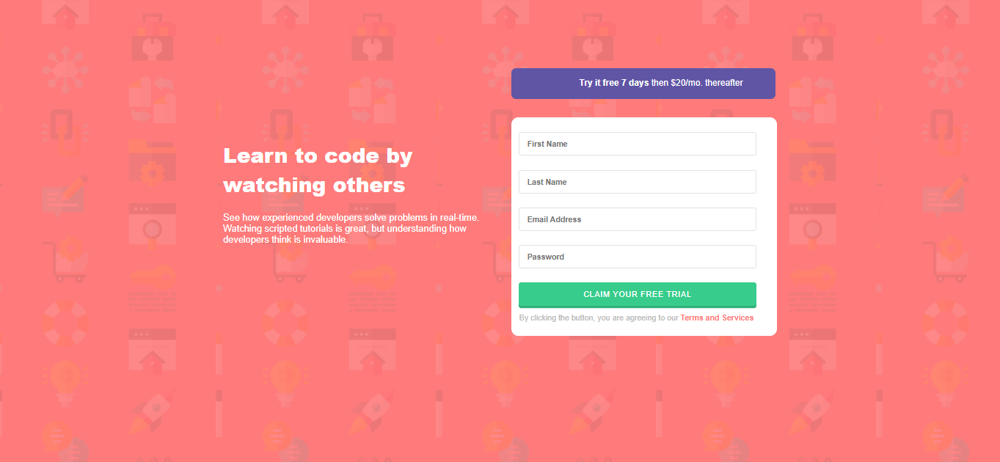

# Intro Component with Signup Form

A responsive landing page with a signup form, recreated for learning purposes using HTML, CSS, and JavaScript.

 Preview

 Built With

- HTML5
- CSS3
- Vanilla JavaScript

## 🎨 Design Inspiration

This project is a frontend recreation of the design provided by [Frontend Mentor](https://www.frontendmentor.io/challenges/intro-component-with-signup-form-BDBRrmNzxa) Only the design was used as inspiration — all code is written by me from scratch.

Features

- Custom client-side form validation
- Responsive design for mobile and desktop
- Error messages and clean UI/UX

